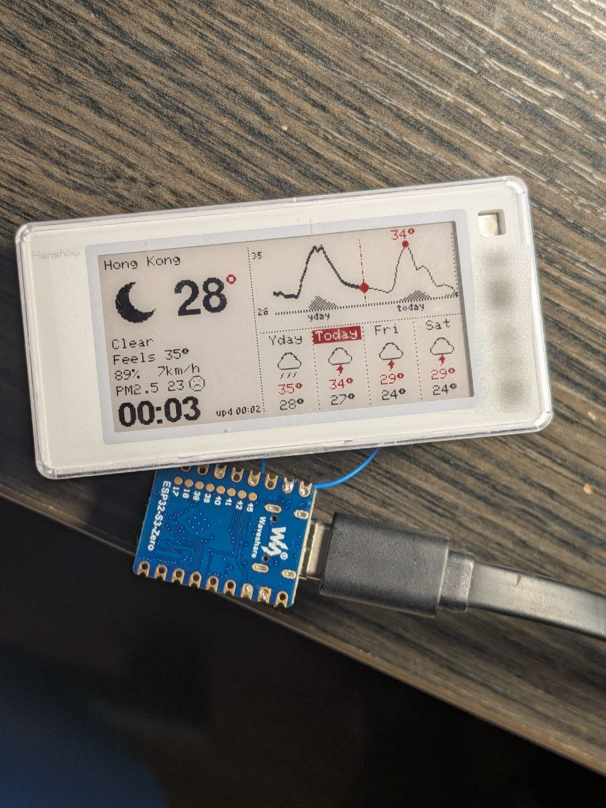
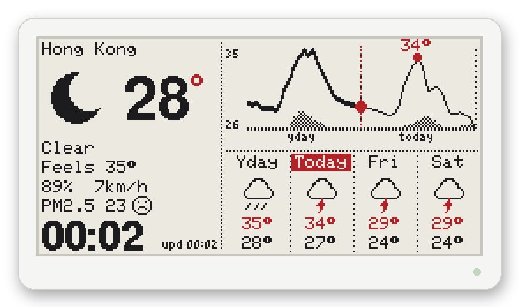
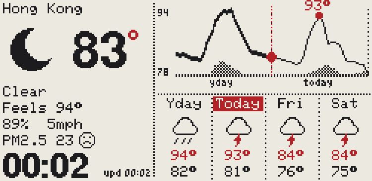
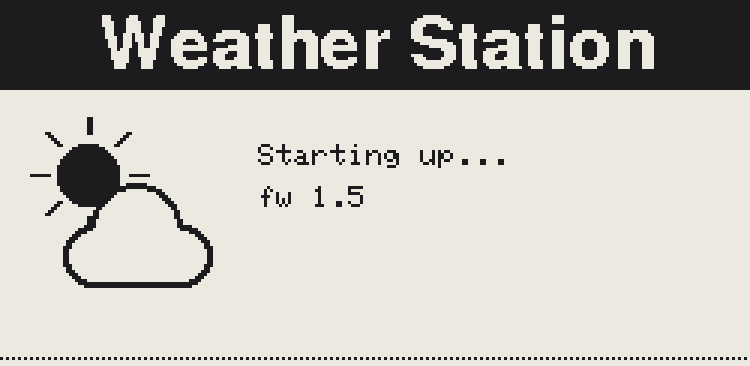
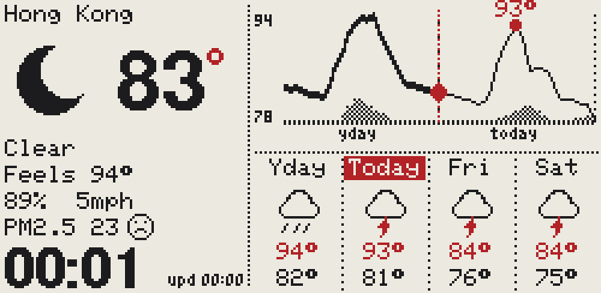
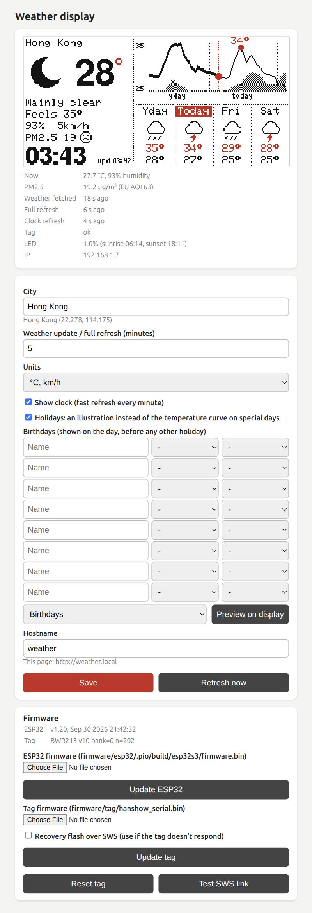
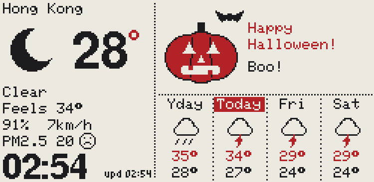
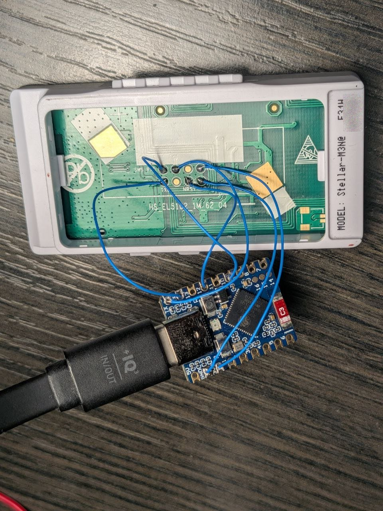

# Hanshow e-paper weather station

Turn a **Hanshow Stellar-M3N@ E31H** electronic shelf label (2.13" 250×122 black/white/red
e-paper, Telink TLSR8359) and a Waveshare ESP32-S3-Zero into a small weather station: current
conditions, a yesterday→tomorrow temperature curve, a 4-day strip, PM2.5 and a clock, with a
settings page on your local network and over-the-air updates for both chips.

> [!IMPORTANT]
> **Not every Hanshow label is compatible.** The tag must use the **Telink TLSR8359** chip.
> From what is known ([atc1441's list](https://github.com/atc1441/ATC_TLSR_Paper#compatible-hanshow-models)),
> those are the Stellar models with an **N** in the code (`Stellar-xxNx`, e.g. `Stellar-M3N@`);
> models without the N use a different chip and won't work. This project also needs the
> 2.13" 250×122 black/white/red panel. See [Compatible labels](#compatible-labels).

<p align="center">
  
  &nbsp;
  
</p>

> **Based on [atc1441/ATC_TLSR_Paper](https://github.com/atc1441/ATC_TLSR_Paper).** The tag
> firmware is built on that project's Telink SDK, toolchain, build system and e-paper driver
> code, and the SWS flasher is ported from its web UART flasher. Many thanks to atc1441. See
> [Acknowledgements](#acknowledgements).

No USB-UART adapter is needed: wire the ESP32 to the tag and it installs the tag firmware itself
over the chip's single-wire debug interface.

## Features

- **Now:** icon (day/night), temperature, feels-like, humidity, wind, PM2.5 with a mood face
  (🙂 < 5, 😐 5–15, 🙁 15–25, and a red face above 25 µg/m³)
- **Temperature curve** from 24 h ago to 24 h ahead, with a bold line for the past, a red "now"
  marker, the next peak labelled in red, rain-probability shading and midnight separators
- **Day strip:** yesterday, today and the next two days with icons, highs in red and lows in black
- **Clock** updated every minute with a ~1.6 s non-flashing fast refresh; the full 3-colour
  refresh only runs when new weather arrives (default every 5 min)
- **Low power:** deep sleep between updates, the settings page stays reachable for 5 minutes
  after power-on, the BOOT button or opening it (see [Power](#power))
- **°C / °F** (with km/h / mph)
- **Holiday illustrations** for 23 holidays and fun days, plus **birthdays** you add in the
  settings (see [Holidays](#holidays))
- **Password-protected settings page** at `http://weather.local`: city (geocoded), update interval, units, clock,
  hostname, a live preview that updates whenever the display refreshes, and status
- **OTA updates** for the ESP32 (web upload or `pio run -e ota -t upload`) and for the tag
  (web upload → dual-bank flash over the serial link, CRC-verified)
- **Self-provisioning:** a factory or blank tag gets its firmware flashed by the ESP32 over SWS,
  and an older tag firmware is updated automatically
- **Status indication:** power-on splash, "connecting to Wi-Fi" and "can't reach server"
  screens, red LED blink codes, and a green refresh LED dimmed by time of day (1 % at night,
  20 % by day, ramped around sunrise/sunset)

| °F, mph | Power-on splash | Server unreachable |
|---|---|---|
|  |  |  |

<p align="center"></p>

## Holidays

On special days the temperature curve makes way for an illustration, a greeting and a joke:

<p align="center"></p>

| | Holidays |
|---|---|
| **Your birthdays** | added on the settings page (see below) |
| **Worldwide** | New Year (Dec 31, Jan 1), Valentine's Day, International Women's Day, St. Patrick's Day, Easter, Halloween, Thanksgiving (US, 4th Thursday of November), Christmas (Dec 24–25) |
| **New years** | Lunar New Year (with the year's zodiac animal), Nowruz, Songkran (Apr 13–15), Islamic New Year, Rosh Hashanah |
| **Religious & cultural** | Eid al-Fitr, Eid al-Adha, Hanukkah (the menorah shows the right number of candles each night), Diwali, Holi, Mid-Autumn Festival |
| **Just for fun** | Pi Day (Mar 14), April Fools' Day (the whole screen is upside down), summer and winter solstice (flipped for the southern hemisphere) |

Turn them all on or off with the **Holidays** checkbox on the settings page; the dropdown next to
it previews any of them on the display for a minute, as it will look on its next occurrence.

**Birthdays** are entered on the settings page (name, month, day, up to 8 people) and stored only
on the device, never in the firmware or this repository. On the day the display shows a cake and
"Happy birthday, *name*!". Birthdays take priority over any other holiday that day.

Easter, Thanksgiving and the fixed dates are computed on the device. The moving
dates (Hebrew, Hijri/Umm al-Qura, Chinese, Persian and Hindu calendars, solstices) are precomputed
for 2026–2045 in `firmware/esp32/src/holiday_tables.h` by `tools/holiday_dates.py`, which can
regenerate them for other years. Islamic and Hindu dates can differ by a day depending on the
region.

## Hardware

| Part | Notes |
|---|---|
| Hanshow **Stellar-M3N@ E31H** (or another compatible label, see below) | 2.13" 250×122 black/white/red panel, Telink TLSR8359 |
| Waveshare **ESP32-S3-Zero** | Any ESP32-S3 with 4 MB flash works; adjust pins in `config.h` if needed. |
| 6 wires | Remove the tag's coin cells: the ESP32 powers it. |

### Compatible labels

The model code is printed on the back of the label (e.g. `MODEL: Stellar-M3N@ E31H`).
Hanshow's naming scheme: **M** = 2.13", **S** = 1.54", **3** = three-colour (black/white/red),
**N** = NFC, **@** = LED, **H** = high resolution. The Telink TLSR8359 this project needs is, as
far as is known, only found in the **N** models.

| Model | Display | Chip | This project |
|---|---|---|---|
| **Stellar-M3N@ E31H** | 2.13" 250×122 black/white/red | TLSR8359 | ✅ developed and tested on this one |
| Stellar-M3N@ E31HA | 2.13" 250×122 black/white/red | TLSR8359 | likely works (same size and colours); untested |
| Stellar-MN@ E31H | 2.13" 250×122 black/white | TLSR8359 | ❌ no red, needs a different panel driver |
| Stellar-MFN@ E31A | 2.13" 212×104 | TLSR8359 | ❌ different resolution and panel driver |
| Stellar-S3TN@ E31HA | 1.54" 200×200 | TLSR8359 | ❌ different resolution and layout |
| Stellar models **without N** | – | not Telink | ❌ incompatible chip |

The ❌ models with a TLSR8359 could be supported with a different panel driver and layout;
contributions welcome.

### Wiring

The tag's test pads are on the back of the PCB, under the battery holder (see also
[atc1441's pad photo](https://github.com/atc1441/ATC_TLSR_Paper/blob/main/USB_UART_Flashing_connection.jpg)).
Six wires go straight from the ESP32-S3-Zero to the pads; no USB-UART adapter is involved:

<p align="center"></p>

| ESP32-S3-Zero | Tag pad | TLSR8359 pin | Purpose |
|---|---|---|---|
| 3V3 | VCC | – | power |
| GND | GND | – | ground |
| GPIO43 (TX) | RXD | PA0 | data to the tag |
| GPIO44 (RX) | TXD | PB1 | replies from the tag |
| GPIO10 | SWS | PA7 | single-wire debug: first-time flashing and recovery |
| GPIO12 | NRST | RESET | hard reset |

> Tip: if the tag reboots whenever the ESP32 sends it something, the TX wire is on NRST instead
> of RXD. "Test SWS link" on the settings page checks the SWS + NRST wiring.

## Getting started

1. **Install PlatformIO:** `pip install platformio`
2. **Your settings:** copy the template and fill in the three values:
   ```sh
   cp firmware/esp32/src/secrets.example.h firmware/esp32/src/secrets.h
   ```
   ```c
   #define WIFI_SSID      "your-wifi"           // Wi-Fi network
   #define WIFI_PASS      "your-wifi-password"  // Wi-Fi password
   #define ADMIN_PASSWORD "admin"               // settings page + OTA updates, change it!
   ```
   `secrets.h` is git-ignored. The default city, hostname and units are in
   `firmware/esp32/src/config.h`, and can all be changed later on the settings page.
3. **Flash the ESP32 once over USB:**
   ```sh
   cd firmware/esp32
   pio run -e esp32s3 -t upload
   ```
   If the board isn't detected, hold BOOT while plugging it in.
4. **Wire the tag** as above and power the ESP32 from any USB supply. On first boot the ESP32
   notices the tag doesn't speak its protocol and installs the bundled tag firmware over SWS
   (about 30 s). The tag then shows the splash, and the weather appears shortly after.
5. **Open `http://weather.local`** (or the ESP32's IP) within 5 minutes of powering it on, log in
   as `admin` with your `ADMIN_PASSWORD`, and set your city. Later, press **BOOT** on the ESP32
   (or power-cycle it) to reach the page again; see [Power](#power).

From then on, everything can be updated over Wi-Fi.

## What the display and LED tell you

| Situation | Screen | Tag LED |
|---|---|---|
| Power-on | "Weather Station / Starting up…" (fast refresh) | green while drawing |
| Wi-Fi not connected after 15 s (it keeps retrying every 30 s, e.g. after a router outage) | "Connecting to Wi-Fi …" | **red, 1 flash every 2 s** |
| Wi-Fi ok, weather server unreachable | "Can't reach weather server" (if nothing shown yet) | **red, 2 flashes every 4 s** |
| Weather shown but stale (3 missed updates) | `! upd HH:MM` in the corner | red codes as above |
| Normal | weather | green blink during each refresh (1 % at night → 20 % by day) |
| ESP32 firmware update | "Receiving new firmware…", then "ESP32 firmware updated, restarting…" or "ESP32 update FAILED: *reason*" | – |
| Tag firmware update | "Updating tag firmware…", then "Tag firmware updated, now running v*N*" or "Tag update FAILED: *reason*" | – |
| Tag on older firmware at boot | "Updating tag firmware v*old* → v*new*" | – |
| City not found | "City not found: *name* – change it on the settings page" | – |

When the tag itself can't display anything, the **ESP32 board's own RGB LED** takes over:

| ESP32 LED | Meaning |
|---|---|
| blue pulses | installing firmware on the tag over SWS (factory/blank/broken tag at boot, or a recovery flash) |
| red blinking | the tag doesn't respond. Reboot the ESP32: it reinstalls the tag firmware if needed. If that doesn't help, check the NRST/SWS wiring. |

Messages stay on the display for a minute (success messages for 10 s), then the weather returns
with a full refresh.

All LED signals except the power-on blink follow the same day/night brightness (1 % at night →
20 % by day), so a Wi-Fi outage at night won't light up the room. If the local time or sunset
isn't known yet (e.g. it booted without Wi-Fi), the night level is used.

## Power

Power saving is on by default (switch it off on the settings page to keep everything always on):

- The **settings page is reachable for 5 minutes** after power-on, after pressing the **BOOT**
  button on the ESP32-S3-Zero, or after the page was last opened (its own auto-refresh doesn't
  count). The status table shows the countdown.
- After that the ESP32 **deep-sleeps**. It wakes once a minute to redraw the clock over the
  serial link with Wi-Fi off (about a second awake), and connects to Wi-Fi only to fetch the
  weather (default every 5 minutes). Full refreshes are started without waiting for them to
  finish, since the tag completes them on its own.
- The **tag suspends** 300 ms after the last serial message and wakes on a pulse from the ESP32.
- While awake: 80 MHz CPU, Wi-Fi modem sleep, and power saving is switched off only while a
  firmware update is being received.
- During each weather wake-up the ESP32 broadcasts a one-line status report on UDP port 47000
  (wake-ups since the last report, draw failures, weather ok/fail, tag version and counters),
  e.g. `nc -ulk 47000` to watch it.

On a power bank, note that many banks switch off below ~50–100 mA; the station draws far less
than that most of the time, so use a bank with an always-on / low-current mode or a USB charger.

## Security

The settings page, its actions and both firmware uploads use HTTP basic auth (user `admin`,
password `ADMIN_PASSWORD`). Network uploads with `pio run -e ota` use the same password, which
`ota_auth.py` reads from `secrets.h`. Setting `ADMIN_PASSWORD` to `""` turns the protection off.
Everything is plain HTTP, so the password protects against casual access on your LAN, not
against someone sniffing your network.

## Firmware updates over Wi-Fi

- **ESP32:** `cd firmware/esp32 && pio run -e ota -t upload`, or upload
  `.pio/build/esp32s3/firmware.bin` on the settings page.
- **Tag:** the ESP32 image bundles `firmware/tag/hanshow_serial.bin` and updates the tag on boot
  if it's older. You can also upload a tag image on the settings page. It's written to the idle
  flash bank, CRC-checked, and only then made bootable, so a failed transfer leaves the old
  firmware running. Tick "Recovery flash over SWS" if the tag no longer responds at all.

## Building the tag firmware

A prebuilt `firmware/tag/hanshow_serial.bin` is included. To rebuild it (Linux x86-64):

```sh
cd firmware/tag
./get_sdk.sh      # fetches the Telink SDK + tc32 toolchain from ATC_TLSR_Paper (~80 MB)
make              # -> hanshow_serial.bin
```

Bump `FW_VERSION` in `firmware/tag/src/main.c` when you change it; the next ESP32 build embeds
the new image and rolls it out to the tag automatically.

## Repository layout

```
firmware/esp32/      ESP32-S3 firmware (PlatformIO, Arduino)
  src/main.cpp         worker task: weather schedule, clock, provisioning, status screens
  src/render.cpp       the 250x122 layout, icons, curve
  src/tag.cpp          serial protocol driver (chunk diffing, fast/full refresh, OTA)
  src/swire.cpp        SWS flasher + NRST (first-time flash / recovery)
  src/weather.cpp      Open-Meteo forecast, air quality and geocoding
  src/web.cpp          settings page, uploads
firmware/tag/        TLSR8359 firmware for the Hanshow tag (Telink SDK, make)
  src/main.c           UART protocol, software UART on SWS, watchdog
  src/epd.c            SSD1680-style BWR driver incl. fast LUT that keeps red pixels
  src/ota.c            dual-bank self-update
tools/               PC helpers: tlsr_flash.py (flash via CH340), eslsend.py (send images
                     via CH340), web_preview.py / esp_preview.py (save the current screen)
docs/protocol.md     serial protocol, framebuffer layout, update scheme
```

## How it works

- **The tag** runs a small firmware without BLE that receives two 4000-byte bitplanes (black,
  red) over UART and drives the panel. A full refresh uses the panel's OTP waveform (~13 s,
  flashes). The fast refresh loads a short custom LUT that pushes black/white pixels and gives red
  pixels a gentle hold pulse, so the clock can update every minute without flashing.
- **The ESP32** renders with Adafruit GFX straight into the panel's native bit layout and sends
  only the 240-byte chunks that changed, so a clock update is 2–3 chunks.
- **Weather** comes from [Open-Meteo](https://open-meteo.com/) (forecast, air quality and
  geocoding; no API key needed). The timezone comes from the forecast response, and time from NTP.

## Acknowledgements

This project is largely based on
**[atc1441/ATC_TLSR_Paper](https://github.com/atc1441/ATC_TLSR_Paper)** (MIT, license in
[`firmware/tag/LICENSE-ATC_TLSR_Paper`](firmware/tag/LICENSE-ATC_TLSR_Paper)), the custom
firmware for Hanshow e-paper shelf labels with the Telink TLSR8359. From it this project uses:

- the Telink TLSR825x SDK, tc32 toolchain and build system (fetched by `firmware/tag/get_sdk.sh`)
- the e-paper SPI driver and the SSD1680-style BWR init sequence, including the partial-refresh
  LUT that the fast refresh is derived from
- the web UART flasher, which `tools/tlsr_flash.py` and the ESP32's SWS flasher (`swire.cpp`)
  are ported from
- the hardware research: pinout, test pads, compatible models and the OTA approach

Also thanks to:

- [pvvx](https://github.com/pvvx) for the SWire-over-UART technique
- [Open-Meteo.com](https://open-meteo.com/) for the weather data (CC BY 4.0)
- [Adafruit GFX](https://github.com/adafruit/Adafruit-GFX-Library) and
  [ArduinoJson](https://arduinojson.org/)

## License

[MIT](LICENSE). Parts derived from atc1441/ATC_TLSR_Paper remain under its MIT license
([`firmware/tag/LICENSE-ATC_TLSR_Paper`](firmware/tag/LICENSE-ATC_TLSR_Paper)). The Telink SDK
and tc32 toolchain fetched by `get_sdk.sh` are not part of this repository and come under their
own terms. Weather data from Open-Meteo is CC BY 4.0.
